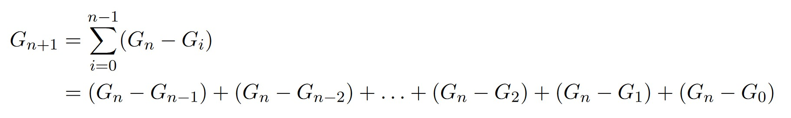
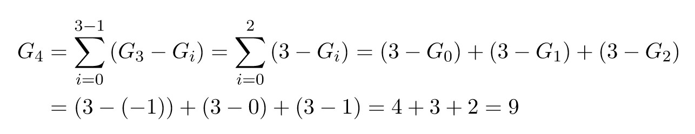
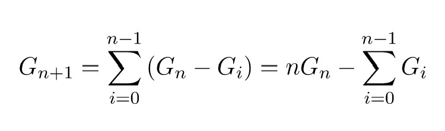
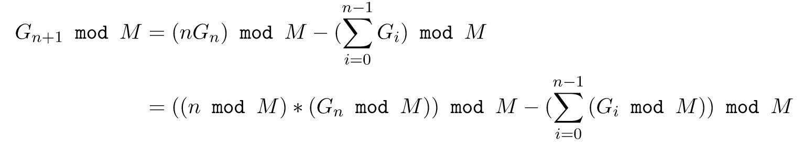

# Spiegazione figonacci

Il testo proposto nel seguente problema è a dir modo molto interessante perchè permette di poter introdurre concetti come l'operazione di modulo, le sue proprietà e perfino un introduzione a programmazione dinamica, una tecnica che avremo modo di approfondire successivamente e che in breve consiste nel memorizzare i risultati delle operazioni precedenti in modo da poterli direttamente utilizzare per quelle successive (senza ricalcolarli nuovamente).

## La sommatoria

Innanzitutto ho preferito analizzare la sommatoria per poterla riscrivere in modo migliore: stavolta non ho intenzione di sparare calcoli a caso, ma di guidarvi passo passo dimostrandovi che l'algoritmica non è fatta (solo) di formule da memorizzare a memoria.

La sommatoria che ci viene presentata ci suggerisce che, per poter calcolare il numero *n+1* della sequenza di Figonacci, abbiamo bisogno di sommare tutte le differenze tra l'*n*-esimo numero e gli *n-1* numeri precedenti, formalmente come indicato dal testo

Vediamo ora cosa vuole effettivamente dire ciò con un esempio concreto: calcoliamo dunque il quarto numero della sequenza sapendo che i precedenti sono -1, 0, 1 e 3 (ricordo che -1 è lo zeresimo numero della sequenza)

Ora che abbiamo compreso meglio il calcolo, possiamo riscriverlo notando ad esempio all'interno della sommatoria Gn è una costante che viene utilizzata *n volte* (basta pensare che la sommatoria va da 0 a n-1). Per questo motivo sarà vero che 

Di primo acchito può sembrare che non sia cambiato nulla, ma la verità è che, riuscendo a separare Gn dalle micro differenze, ora abbiamo la possibilità di memorizzare la somma parziale dei valori da 0 a n-1 per poter calcolare il numero (n+1)-esimo della sequenza

## Programmazione Dinamica

Che cos'è programmazione dinamica? Si tratta di una tecnica per cui, vista la difficoltà del problema, si preferisce scomporlo in parti più piccole (come si farebbe per un algoritmo di tipo *Divide et Impera*), con la differenza che, visto che i calcoli potrebbero ripetersi diverse volte, i risultati parziali vengono memorizzati all'interno di una struttura dati (variabile, vettore, matrice quadrata, ...) in modo da essere sempre disponibili per i calcoli successivi.

In questo caso, se analizziamo la sommatoria, ogni volta che ci viene richiesto di calcolare Gn+1 dobbiamo continuamente eseguire la somma degli elementi con indice da 0 a n-1: sarebbe assurdo dover ogni volta eseguire la somma di questi termini quando l'abbiamo già quasi completata calcolando Gn, è invece molto più produttivo memorizzare

* il valore di Gn, che corrisponde al numero precedente della serie di Figonacci che ci viene chiesto di calcolare
* la somma dei precedenti G0, ..., Gn-1 numeri

Ogni volta che calcoleremo un nuovo valore

* Aggiungeremo Gn alla somma dei valori precedenti, in modo da ottenere G0 + ... + Gn
* Assegneremo a Gn il valore del numero di figonacci appena calcolato (cioè Gn+1)

In questo modo potremo applicare la stessa identica formula per calcolare Gn+2, Gn+3, ...

## Modulo

Il calcolo tuttavia non finisce qui: l'esercizio richiede infatti di restituire il valore dato da *Gn % M*, cioè dall'operazione di modulo tra l'n-esimo numero di figonacci e il numero M.

Nonostante sarebbe effettivamente possibile eseguire questa operaione alla fine, come è sottolineato dal testo i numeri di figonacci crescono molto rapidamente e, per questo motivo, rischiano di fare overflow se memorizzati in un banale int.

A questo punto la strada più facile sarebbe quella di memorizzare i numeri di figonacci all'interno di una variabile di tipo *long long unsigned int* (contenente il numero intero più grande memorizzabile in C), ma se vi dicessi che non è sufficiente? Ovviamente questo non è il caso, ma alcuni problemi reali lavorano su dati di grandissima dimensione e, anche se si ha la possibilità di memorizzare effettivamente questi dati, si preferisce utilizzare altri metodi per ridurre la mole i lavoro che può derivare dalla somma di una quantità esorbitante di bit.

Sfruttiamo dunque l'occasione per poter risolvere questa problematica con l'operazione di modulo. Vi ricordo innanzitutto (come scritto nel testo) che

* (A + B) % M = (A % M + B % M) % M
* (A * B) % M = (A % M * B % M) % M

Utilizzando queste proprietà, abbiamo la possibilità di modificare la nostra formula come segue

Questo vuol dire che non è necessario memorizzare la sommatoria degli elementi ma è possibile eseguire ogni volta l'operazione di modulo in modo da mantenere bassisimo sia il costo delle operazioni sia la quantità di memoria utilizzata. 