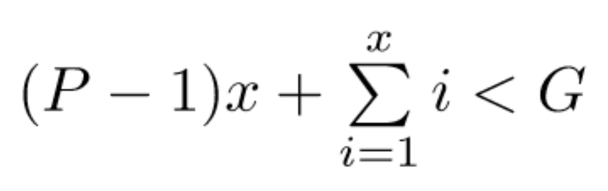
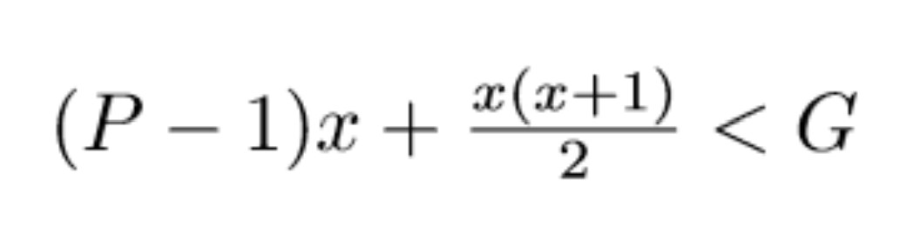
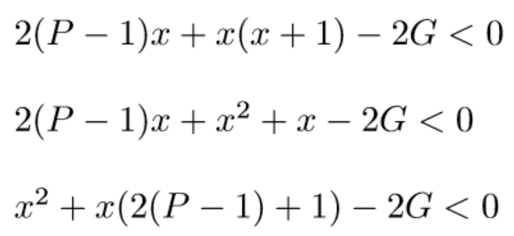
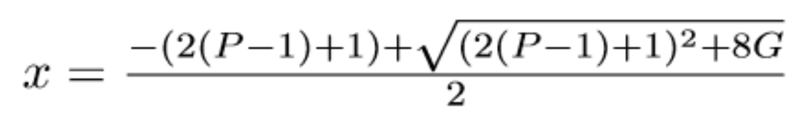

# Spiegazione spartizioni_v2

Ho deciso di proporre una soluzione matematicamente più intelligente che, nonostante dia gli stessi risultati del file [spartizioni.cpp](./spartizioni.cpp), vi posso assicurare che per numeri grandi può portare a risultati decisamente migliori. 

## Robbe Matematiche

Sappiamo, da come è posto il problema, che Toto prende ogni volta una gemma in più, mentre continua a dare alle altre persone soltanto una gemma.

Dati *G*, numero di gemme totali, *P*, numero di persone totali (compreso Toto), *x* è il numero di volte per cui tutti hanno la possibilità di prendere un numero di gemme rispettando i vincoli imposti, cioè

* P-1 persone (perchè Toto prende un numero crescente di gemme ogni turno) prenderanno in totale una gemma a testa un numero di volte pari a *x*
* Toto invece prende per l'appunto un numero di gemme che si incrementa ogni turno, il che vuol dire che la prima volta prenderà una gemma, poi due, poi tre e così via... Questo è esprimibile matematicamente con la *sommatoria da 1 a x* (che corrisponde ad un modo elegante per scrivere *1 + 2 + 3 + ... + x*). 

Il punto è che il valore *x* che cerchiamo corrisponde all'ultimo turno per cui è possibile far valere questa relazione, cioè per cui sia Toto che le altre persone riusciranno a prendere *P-1 + x* gemme: dal turno successivo ciò non sarà possibile perchè non rimarranno abbastanza gemme e quindi

* se il numero di gemme lo permetterà allora Toto prenderà *x+1* gemme e le restanti andranno alle altre *P-1* persone (non ci interessa se non tutti avranno almeno una gemma)
* oppure Toto prenderà semplicemente le gemme rimanenti

Per poter effettivamente ottenere un algoritmo migliore, abbiamo bisogno però di "srotolare" la sommatoria in modo da evitare di calcolarla facendo uso di cicli, aumentando quindi la complessità.

Rendendomi conto che l'argomento non sia esattamente facilissimo (non impossibile ma non penso che piaccia nemmeno a voi masticare così tanta matematica), vi fornisco la soluzione a questo dilemma

Con un po' di passaggi matematici è possibile arrivare alla seguente disequazione di secondo grado

Il valore *x* che stiamo cercando sarà dunque pari a

Ovviamente il valore che troveremo potrebbe essere un numero non intero, ma a noi interessa sapere l'ultimo turno (che per definizione è intero) per cui valgono le condizioni dichiarate precedentemente: per questo motivo utilizziamo la funzione *floor* sul risultato per restituire l'estremo inferiore, cioè il numero intero più piccolo vicino al risultato ottenuto, cioè

* se *x=3.2*, *floor(x) = 3*
* se *x=3.8*, *floor(x) = 3*

A questo punto potremo dunque calcolare il numero di gemme che Toto riuscirà sicuramente a prendere, cioè *x(x+1)/2*, e poi, sulla base delle gemme rimanente, Toto prenderà *x+1* gemme oppure tutte le gemme rimaste.